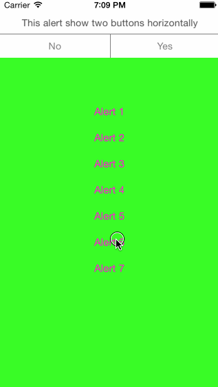

# TAlertView

## Preview



## Features

- simple to use
- block syntax
- physically animated user interaction
- UIAppearance support

## Usage

To run the example project, clone the repo, and run `pod install` from the Example directory first.


## Installation

TAlertView is available through [CocoaPods](http://cocoapods.org). To install
it, simply add the following line to your Podfile:

	pod "TAlertView"

## How To Use It

### Simple

```objc
[[[TAlertView alloc] initWithTitle:@"Great!" andMessage:@"This is a basic alert"] show];

```


### Or with buttons


```objc
TAlertView *alert = [[TAlertView alloc] initWithTitle:nil
                                              message:@"This alert show two buttons horizontally"
                                              buttons:@[@"No", @"Yes"]
                                          andCallBack:^(TAlertView *alertView, NSInteger buttonIndex) {
                                                          //Your actions
                                                      }];
alert.buttonsAlign = TAlertViewButtonsAlignHorizontal;
[alert showAsMessage];

```


### Change appearance


```objc
TAlertView *appearance = [TAlertView appearance];
    appearance.alertBackgroundColor     = [[UIColor blackColor] colorWithAlphaComponent:0.8];
    appearance.titleFont                = [UIFont fontWithName:@"Baskerville" size:22];
    appearance.messageColor             = [UIColor whiteColor];
    appearance.messageFont              = [UIFont fontWithName:@"Baskerville-SemiBoldItalic" size:14];
    appearance.buttonsTextColor         = [UIColor whiteColor];
    appearance.buttonsFont              = [UIFont fontWithName:@"Baskerville-Bold" size:16];
    appearance.separatorsLinesColor     = [UIColor grayColor];
    appearance.tapToCloseFont           = [UIFont fontWithName:@"Baskerville" size:10];
    appearance.tapToCloseColor          = [UIColor grayColor];
    appearance.tapToCloseText           = @"Touch to close";
    [appearance setTitleColor:[UIColor orangeColor] forAlertViewStyle:TAlertViewStyleError];
    [appearance setDefaultTitle:@"Error" forAlertViewStyle:TAlertViewStyleError];
    [appearance setTitleColor:[UIColor whiteColor] forAlertViewStyle:TAlertViewStyleNeutral];

```

## Author

Washington Miranda, mirandaacevedo@gmail.com

## License

TAlertView is available under the MIT license. See the LICENSE file for more info.

